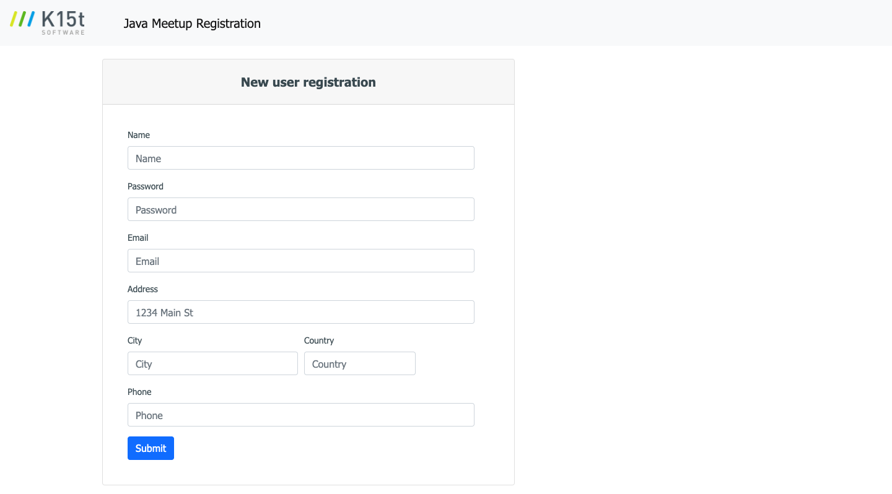

# Full-Stack Developer Sample Project


## What is it about?
Here we have a small web application allowing to register for the next Java Meetup.
Unfortunately the most important part of the app is still missing. The form 
fields as well as the backend to store the data in memory. But you are here to 
help us out and get it done.
 
## But *what* should I do exactly?
Extend the form with the required fields (see registration.vm for further details) and 
store the entered information by using a REST endpoint. Giv the user feedback if the
save was successful or in case of an error. Ensure mandatory fields will be entered
and verify the entered values are reasonable e.g. the name must not contains numbers.

To start with, please see the already created files and classes. Especially:

* com.k15t.pat.registration: The package includes a REST endpoint and a controller
* resources/templates: The folder includes the initial velocity templates for the registration page 

The Maven build creates a executable jar which includes the whole runtime (tomcat) to run the app.
You can start it with java -jar registration-0.1.0.jar. If the application is started the pages are
available under http://localhost:8080/registration.html

## A few words about the technology stack
The application is build on top of Spring Boot (http://projects.spring.io/spring-boot/) providing a runtime container. 
Furthermore Jersey for implementing REST resources, Velocity for templating pages and jQuery/Bootstrap is included and 
can be used as well. Building and packaging the application is done with Maven. 

## Solution

I upgraded to the latest version of Spring Boot to not deal with lots of deprecations, 
Spring Boot 1.3.6 originally proposed in the task is quite old now (JULY 04, 2016).

I replaced Velocity template engine with Thymeleaf which is much better integrated in Spring Boot.
Velocity has been deprecated since Spring 4.3 and removed in Spring 5.0 (more details https://github.com/spring-projects/spring-framework/issues/18368, https://github.com/spring-projects/spring-framework/issues/17826)
- "Velocity 1.7 dates back to 2010. Following up on the deprecation of our Velocity support in Spring 4.3, let's not include it to begin with in the 5.0 generation."

The discussion between Juergen Hoeller (lead and co-founder of Spring Framework) and Velocity folks:
- "We are not in the business of deprecating Velocity in general in any case ;-) #17826 deprecated our Velocity support package in the core framework distribution, and this issue here is just about actually removing it towards Spring Framework 5.0.
In the end, we don't want to drag along an outdated dependency - with a limited audience among Spring developers in the meantime - into a new major generation of the framework. Note that our traditional Velocity support package remains around in Spring Framework 4.3.x which we're maintaining until 2019. We have been reducing our optional third-party dependencies for a while, asking maintainers to ship Spring support on their end instead, e.g. for Thymeleaf and Ibatis. Feel free to do this for Velocity 2.0 as well as it materializes, even with support for Spring Framework 4.x since the View contract remains identical anyway.
For Spring 5, we are strategically moving away from traditional template-based web views in general. Even just for that reason alone, we are not going to introduce support for any new template engine generations but rather focus on other areas (Jackson integration, JavaScript templates, etc). FWIW, we are going to keep supporting FreeMarker as a sort of reference - in classic Servlet MVC as well as Spring's new reactive web support -, including our generic base classes for template-based views which other support classes may derive from (like the Velocity 1.x based view classes do right now)."

I was not able to make it work in the latest version of Spring Boot: Jersey, Velocity and Bean validations. 
That's why i replace jersey with Spring MVC Rest and Velocity with Thymeleaf. 
Thymeleaf templates are html files which are more readable and handled better by most of the editors than .vm files and could be opened also by web developers/uix team.

Bean validations could have been implemented in the client side using ex: https://jqueryvalidation.org/ 
but i think it's more safe to keep the validations on the backend. I replaced Jersey also for the fact that it doesn't work with mockmvc and it needs lots of configurations to make it work properly in Spring Boot 2.2.0.
 
The provided stack: Spring Boot (web), Thymeleaf, Spring Data Jpa needs no configuration at all to build a production ready application.   

## How to start 

Installs the necessary dependencies to make the application work:

```mvn install```  (tests run automatically)

Create a single jar that can be run in the command line:

```mvn clean package```

The server starts on port 8080: http://localhost:8080 which redirects to http://localhost:8080/registration.html

- The input form looks like this:


- Once submit is successful the response is:


- In case the name already exists it shows:


#### Model structure
    {
        "id"        : <number>, (autogenerated)
        "name"      : <string>, regex validation: ^[a-zA-Z ]*$
        "password"  : <string>, (encrypted) Length min = 8
        "email"     : <string>, regex validation: .+@.+\\..+
        "address"   : <string>,
        "city"      : <string>,
        "country"   : <string>,
        "phone"     : <string>  regex validation: ^[0-9+]*$
    }
    
#### Create a new user through rest api
    POST /api/registration
    {
        "name": "Julian Vasa",
        "password": "12345678",
        "email": "test@test.com",
        "address": "My address",
        "city": "Tirane",
        "country": "Albania",
        "phone": "1213123213"
    }

Example response:

    HTTP 201 CREATED
    POST /api/registration
    {
        "id": 1,
        "name": "Julian Vasa",
        "password": "$2a$10$5M0nttOgSVCIaIJy0w4XqO.YNYr9AGWyeTZVX5eKl38mC6W27oR/.",
        "email": "test@test.com",
        "address": "My address",
        "city": "Tirane",
        "country": "Albania",
        "phone": "1213123213"
    }
    
In case the name already exists the response is:

    HTTP 409 CONFLICT
    POST /api/registration
    {
        "code": "USER_ALREADY_EXISTS",
        "description": "A user with the given username already exists"
    }    
    
